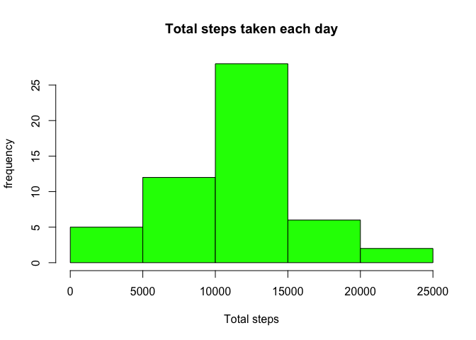
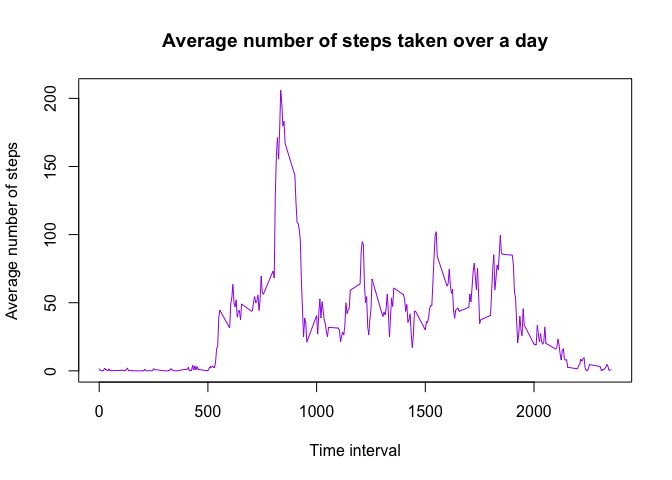
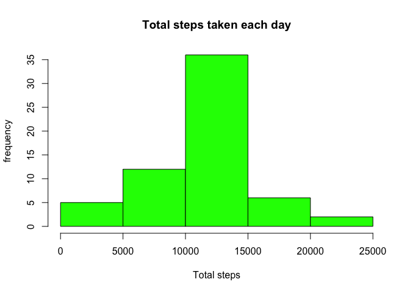
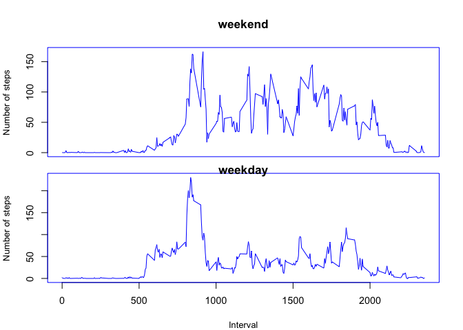

# Reproducible Research: Peer Assessment 1
In this document, the process will be described for an analysis of a dataset collected from a personal activity monitoring device on one individual.  This data includes number of steps taken over 5 minute intervals during a two month period in late 2012.


## Loading and preprocessing the data

First, the data must be loaded, after setting the directory to the appropriate location where the dataset may be found. 

```r
activitydata<-read.csv("activity.csv",header=TRUE)
```


## What is mean total number of steps taken per day?

The total number of steps taken per day can be calculated, and a histogram subsequently generated, with the following code.  


```r
library(plyr)
totalsteps<-ddply(activitydata,.(date), summarise, total_steps=sum(steps))
totalsteps
```

```
##          date total_steps
## 1  2012-10-01          NA
## 2  2012-10-02         126
## 3  2012-10-03       11352
## 4  2012-10-04       12116
## 5  2012-10-05       13294
## 6  2012-10-06       15420
## 7  2012-10-07       11015
## 8  2012-10-08          NA
## 9  2012-10-09       12811
## 10 2012-10-10        9900
## 11 2012-10-11       10304
## 12 2012-10-12       17382
## 13 2012-10-13       12426
## 14 2012-10-14       15098
## 15 2012-10-15       10139
## 16 2012-10-16       15084
## 17 2012-10-17       13452
## 18 2012-10-18       10056
## 19 2012-10-19       11829
## 20 2012-10-20       10395
## 21 2012-10-21        8821
## 22 2012-10-22       13460
## 23 2012-10-23        8918
## 24 2012-10-24        8355
## 25 2012-10-25        2492
## 26 2012-10-26        6778
## 27 2012-10-27       10119
## 28 2012-10-28       11458
## 29 2012-10-29        5018
## 30 2012-10-30        9819
## 31 2012-10-31       15414
## 32 2012-11-01          NA
## 33 2012-11-02       10600
## 34 2012-11-03       10571
## 35 2012-11-04          NA
## 36 2012-11-05       10439
## 37 2012-11-06        8334
## 38 2012-11-07       12883
## 39 2012-11-08        3219
## 40 2012-11-09          NA
## 41 2012-11-10          NA
## 42 2012-11-11       12608
## 43 2012-11-12       10765
## 44 2012-11-13        7336
## 45 2012-11-14          NA
## 46 2012-11-15          41
## 47 2012-11-16        5441
## 48 2012-11-17       14339
## 49 2012-11-18       15110
## 50 2012-11-19        8841
## 51 2012-11-20        4472
## 52 2012-11-21       12787
## 53 2012-11-22       20427
## 54 2012-11-23       21194
## 55 2012-11-24       14478
## 56 2012-11-25       11834
## 57 2012-11-26       11162
## 58 2012-11-27       13646
## 59 2012-11-28       10183
## 60 2012-11-29        7047
## 61 2012-11-30          NA
```

```r
hist(totalsteps$total_steps, main="Total steps taken each day", xlab="Total steps", ylab="frequency", col="green")
```

 

The mean and median of the total number of steps taken per day is determined here:


```r
mean(totalsteps$total_steps, na.rm=TRUE)
```

```
## [1] 10766.19
```

```r
median(totalsteps$total_steps, na.rm=TRUE)
```

```
## [1] 10765
```


## What is the average daily activity pattern?

The activity pattern over the course of a day can be examined using the interval data.  First, data containing "NA" for number of steps should be eliminated from the dataset.  The average number of steps for each time interval can be calculated.  Then, a time series plot may be generated showing the average number of steps taken over each five minute interval, over the time period studied.


```r
activitydatacomp<-na.omit(activitydata)
intervals<-ddply(activitydatacomp,.(interval), summarise, average_steps=mean(steps))
with(intervals, plot(interval, average_steps, type="l", main="Average number of steps taken over a day", ylab="Average number of steps",xlab="Time interval",col="purple"))
```

 

The time interval which contains the largest number of steps on average is:


```r
intervals[which(intervals$average_steps== max(intervals$average)),]
```

```
##     interval average_steps
## 104      835      206.1698
```


## Imputing missing values

It is important to keep track of the number of NAs to make sure that the data is not biased.  First the number of rows of data containing NAs should be determined.


```r
sum(!complete.cases(activitydata))
```

```
## [1] 2304
```

Then all the NA values may be replaced with the values for the average number of steps in that time interval, over the days of the study.  This requires generating a function to replace the NAs with a mean for that value, and then applying the function to the subset of the dataframe with the same time interval.  Afterwards the dataframe may be reordered by date and interval to restore it to a similar format to the original dataframe.


```r
impute.mean<-function(x) replace(x, is.na(x), mean(x, na.rm=TRUE))
activitydataimput<-ddply(activitydata, ~ interval, transform, steps = impute.mean(steps))
activitydataimputord<-activitydataimput[order(activitydataimput$date,activitydataimput$interval),]
```

After the missing data imputation, a histogram of total steps taken may be redrawn to see if it has changed, and the mean and median recalculated.


```r
totalstepsimput<-ddply(activitydataimputord,.(date), summarise, total_steps=sum(steps))
totalstepsimput
```

```
##          date total_steps
## 1  2012-10-01    10766.19
## 2  2012-10-02      126.00
## 3  2012-10-03    11352.00
## 4  2012-10-04    12116.00
## 5  2012-10-05    13294.00
## 6  2012-10-06    15420.00
## 7  2012-10-07    11015.00
## 8  2012-10-08    10766.19
## 9  2012-10-09    12811.00
## 10 2012-10-10     9900.00
## 11 2012-10-11    10304.00
## 12 2012-10-12    17382.00
## 13 2012-10-13    12426.00
## 14 2012-10-14    15098.00
## 15 2012-10-15    10139.00
## 16 2012-10-16    15084.00
## 17 2012-10-17    13452.00
## 18 2012-10-18    10056.00
## 19 2012-10-19    11829.00
## 20 2012-10-20    10395.00
## 21 2012-10-21     8821.00
## 22 2012-10-22    13460.00
## 23 2012-10-23     8918.00
## 24 2012-10-24     8355.00
## 25 2012-10-25     2492.00
## 26 2012-10-26     6778.00
## 27 2012-10-27    10119.00
## 28 2012-10-28    11458.00
## 29 2012-10-29     5018.00
## 30 2012-10-30     9819.00
## 31 2012-10-31    15414.00
## 32 2012-11-01    10766.19
## 33 2012-11-02    10600.00
## 34 2012-11-03    10571.00
## 35 2012-11-04    10766.19
## 36 2012-11-05    10439.00
## 37 2012-11-06     8334.00
## 38 2012-11-07    12883.00
## 39 2012-11-08     3219.00
## 40 2012-11-09    10766.19
## 41 2012-11-10    10766.19
## 42 2012-11-11    12608.00
## 43 2012-11-12    10765.00
## 44 2012-11-13     7336.00
## 45 2012-11-14    10766.19
## 46 2012-11-15       41.00
## 47 2012-11-16     5441.00
## 48 2012-11-17    14339.00
## 49 2012-11-18    15110.00
## 50 2012-11-19     8841.00
## 51 2012-11-20     4472.00
## 52 2012-11-21    12787.00
## 53 2012-11-22    20427.00
## 54 2012-11-23    21194.00
## 55 2012-11-24    14478.00
## 56 2012-11-25    11834.00
## 57 2012-11-26    11162.00
## 58 2012-11-27    13646.00
## 59 2012-11-28    10183.00
## 60 2012-11-29     7047.00
## 61 2012-11-30    10766.19
```

```r
hist(totalstepsimput$total_steps, main="Total steps taken each day", xlab="Total steps", ylab="frequency", col="green")
```

 

```r
mean(totalstepsimput$total_steps, na.rm=TRUE)
```

```
## [1] 10766.19
```

```r
median(totalstepsimput$total_steps, na.rm=TRUE)
```

```
## [1] 10766.19
```

If the results from the imputed dataset are compared to the original, one can see that NA data have been replaced with numbers that constitute an average number of steps per day.  The histogram is relatively similar although the number of days in which an average number of steps has been taken has greatly increased since average step values were artificially inserted into the days where no data was taken (lots of NA values).  The mean total number of steps taken per day is completely unchanged and the median total number of steps taken per day is only slightly changed (from 10765 to 10766.19).  
  In summary, imputing missing data using mean values leaves overall mean values intact but does lead to a misleading number of datapoints where average values are recorded, leading to a taller central peak.
  


## Are there differences in activity patterns between weekdays and weekends?

The following code will be used to investigate if there is a difference in steps taken by this individual on weekdays compared to the weekend.  First each row of data must be classified by day of the week. This vector can then be simplified to two levels, either weekday or weekend. Then this vector can be converted to factor format and added to the original data frame.


```r
dateposix<-as.POSIXct(activitydataimputord$date)
weekdaylabel<-weekdays(dateposix)
weekdaylabel[weekdaylabel== "Monday"] <- "weekday"
weekdaylabel[weekdaylabel== "Tuesday"] <- "weekday"
weekdaylabel[weekdaylabel== "Wednesday"] <- "weekday"
weekdaylabel[weekdaylabel== "Thursday"] <- "weekday"
weekdaylabel[weekdaylabel== "Friday"] <- "weekday"
weekdaylabel[weekdaylabel== "Saturday"] <- "weekend"
weekdaylabel[weekdaylabel== "Sunday"] <- "weekend"
factorweekdaylabel<-factor(weekdaylabel)
activitydataimputord$weekday<-weekdaylabel
```

Next the data frame is split by weekday level and the average number of steps is calculated for each time interval. The resulting data frame is separated into two data frames, one for weekend and one for weekdays. These new data frames are used to generate a panel plot.

The first panel shows the average number of steps taken over the course of the average weekend day, with each 5 minute time interval on the x-axis.  The bottom panel shows the same information over the course of the average weekday.


```r
intervals2<-ddply(activitydataimputord,.(weekday, interval), summarise, average_steps=mean(steps))
intervalsweekday<-intervals2[1:288,]
intervalsweekend<-intervals2[289:576,]
par(mfcol=c(2,1))  #creates matrix of 2 graphs, one over the other
par(cex=0.9)
par(cex.lab=0.9)
par(col="blue")
par(mar=c(0.7,4,4,2))
with(intervalsweekend, {plot(interval, average_steps, type="l",main="weekend",ylab="Number of steps",xaxt="n")})
par(mar=c(4,4,0.7,2))
with(intervalsweekday, {plot(interval, average_steps, type="l",main="weekday",ylab="Number of steps",xlab="Interval")})
```

 
